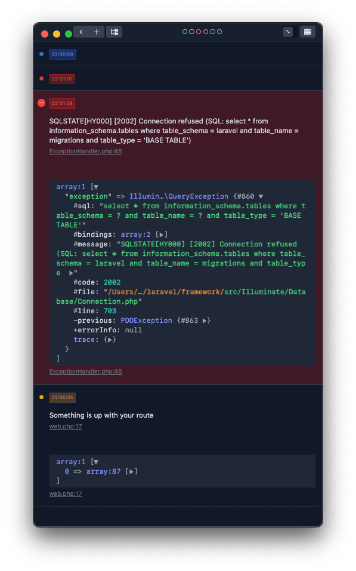

# Laravel Ray Logging

A log channel that sends all laravel logging through [Ray](https://spatie.be/products/ray).

Using Ray to monitor log messages makes debugging during development easier more convenient to tailing the laravel log,
but it can also be useful when monitoring production applications through SSH.

## Features

- Allows dumping complex data structures (models, large arrays, etc) that don't translate well to text only log files
- Each level can be assigned to a different color, which also allows it to be filtered
- The filename and line number of the log message is included in each log, so one click brings your editor to the exact place the log message was called
- Minimum log level and colors are configurable

i

## Install

You can install this package via composer using this commands:

```sh
composer require afdev/laravel-ray-log-channel
```

## Configuration

Add the channel to config/logging.php

```   
'channels' => [
  ...
  'ray' => [
    'driver' => 'ray',
    'level' => 'debug',
  ]
]
```

Use the log channel in .env :

    LOG_CHANNEL=ray

Optionally, you can customize the used colors for each level: 

```   
'ray' => [
  'driver' => 'ray',
  'level' => 'debug',
  'colors' => [ 
      'blue' => ['DEBUG', 'INFO', 'INFO123'],
      'green' => ['NOTICE'],
      'yellow' => ['WARNING'],
      'red' => ['ERROR', 'CRITICAL', 'ALERT', 'EMERGENCY', 'API'],
  ]
]
```

